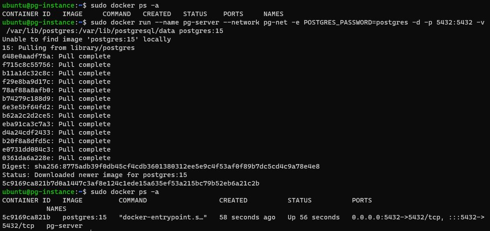
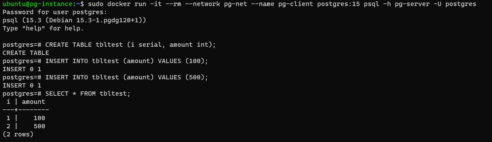
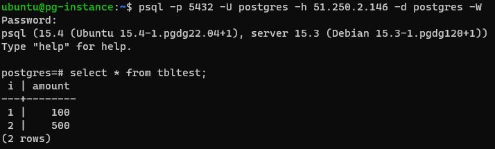
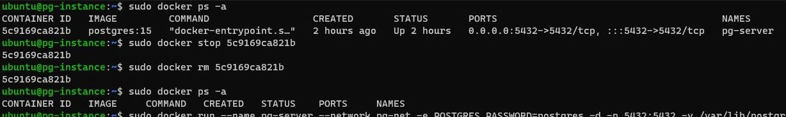
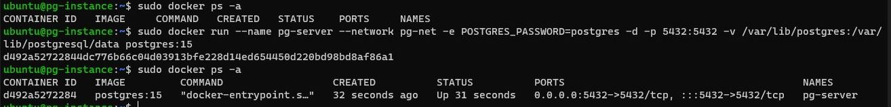
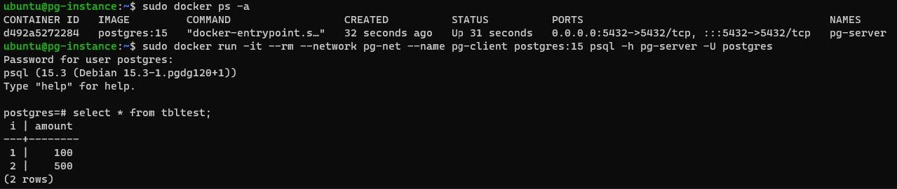

# Домашнее задание №2

Описание/Пошаговая инструкция выполнения домашнего задания:
* создать ВМ с Ubuntu 20.04/22.04 или развернуть докер любым удобным способом
* поставить на нем Docker Engine
* сделать каталог /var/lib/postgres
* развернуть контейнер с PostgreSQL 15 смонтировав в него /var/lib/postgresql
  > скрин: 
* развернуть контейнер с клиентом postgres
* подключится из контейнера с клиентом к контейнеру с сервером и сделать
таблицу с парой строк
  > скрин: 
* подключится к контейнеру с сервером с ноутбука/компьютера извне инстансов GCP/ЯО/места установки докера
psql -p 5432 -U postgres -h 51.250.2.146 -d postgres -W
  > скрин: 
* удалить контейнер с сервером
  > скрин: 
* создать его заново
  > скрин: 
* подключится снова из контейнера с клиентом к контейнеру с сервером, проверить, что данные остались на месте
  > скрин: 

